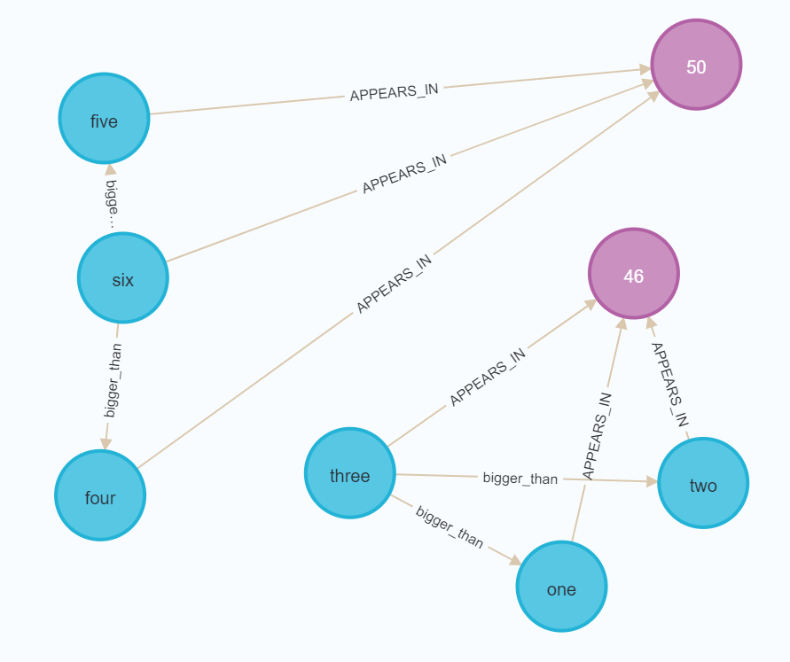

Basic Functionality
===================

Loading data
------------

There are two ways to load data into a Puggle :class:`~puggle.Dataset.Dataset`: from file(s), or programatically in Python.

Loading from files
^^^^^^^^^^^^^^^^^^

Here is an example of loading in a set of annotations from a machine learning model, and combining those annotations with a structured CSV dataset.

First, import puggle and create an empty `Dataset`:

.. code-block:: python

   from puggle import Dataset
   d = Dataset()

Then you can use the `load_documents` function to load a list of documents from a CSV file and a JSON file. Your structured data should be stored in the csv, and your annotations (e.g. the output of a machine learning model such as SPERT) should be stored in the JSON file.

.. code-block:: python

    d.load_documents(
        sd_filename="sample_data/documents.csv",
        anns_filename="sample_data/annotations.json",
        anns_format="spert",
    )

Valid `anns_format` options are currently `quickgraph` and `spert`. Specifying a format is necessary because each of these formats differ slightly - for example, Quickgraph stores relationships differently, and uses a `label` key for its relations rather than `type`.

See :doc:`data_format` for more information on the required data formats.

Creating documents programatically
^^^^^^^^^^^^^^^^^^^^^^^^^^^^^^^^^^

You can also create a dataset and populate it programatically. Here is an example of creating the same Dataset as above, but fully in Python.

Note that your data will need to adhere to the format below. At this stage the ability to read either `quickgraph` or `spert` formats are limited to the `load_documents` function.

.. code-block:: python

    from puggle import Dataset, Document, Annotation

    d = Dataset()

    f1 = {"text": "one three two", "date": "12/05/2020", "x": "4", "y": "test"}
    a1 = Annotation.from_dict(
        {
            "tokens": ["one", "three", "two"],
            "entities": [
                {"start": 0, "end": 1, "labels": ["number"]},
                {"start": 1, "end": 2, "labels": ["number"]},
                {"start": 2, "end": 3, "labels": ["number"]},
            ],
            "relations": [
                {"start": 1, "end": 0, "type": "bigger_than"},
                {"start": 1, "end": 2, "type": "bigger_than"},
            ],
        }
    )

    doc1 = Document(f1, a1)
    d.add_document(doc1)

    f2 = {"text": "four six five", "date": "04/05/2020", "x": "12", "y": "another"}
    a2 = Annotation.from_dict(
        {
            "tokens": ["four", "six", "five"],
            "entities": [
                {"start": 0, "end": 1, "labels": ["number"]},
                {"start": 1, "end": 2, "labels": ["number"]},
                {"start": 2, "end": 3, "labels": ["number"]},
            ],
            "relations": [
                {"start": 1, "end": 0, "type": "bigger_than"},
                {"start": 1, "end": 2, "type": "bigger_than"},
            ],
        }
    )

    doc2 = Document(f2, a2)
    d.add_document(doc2)

Note that we call the `from_dict` function in the `Annotation` class to convert the dictionary into an Annotation object. We can then include the fields (dictionary) and this Annotation object as arguments to the constructor of the `Document` class, then add this newly-created `Document` object to our dataset.

Loading your data into Neo4j automatically
------------------------------------------

Once they are loaded, you can use the `load_into_neo4j` function to automatically create a Neo4j graph:

.. code-block:: python

   d.load_into_neo4j(recreate=True)

The `recreate=True` causes the graph to be recreated from scratch.

You can then open up the Neo4j browser and write queries over your documents/entities/relationships. For example, here is what it looks like when running `MATCH (n) RETURN n` on the sample data:

Saving data
-----------

The :class:`~puggle.Dataset.Dataset`'s :func:`~puggle.Dataset.Dataset.save_to_file` function allows you to save your dataset to one of two formats: `json` or `quickgraph`.

The `json` format simply dumps each document into a JSON object. An example of one document from the `json` output format is as follows:

.. code-block:: json

    {
        "fields": null,
        "annotations": {
          "tokens": [
            "<id>",
            "air",
            "freight",
            "for",
            "pump",
            "TBC"
          ],
          "mentions": [
            {
              "start": 4,
              "end": 5,
              "tokens": [
                "pump"
              ],
              "labels": [
                "PhysicalObject"
              ]
            },
            {
              "start": 1,
              "end": 3,
              "tokens": [
                "air",
                "freight"
              ],
              "labels": [
                "Activity"
              ]
            }
          ],
          "relations": [
            {
              "start": 1,
              "end": 0,
              "type": "hasParticipant"
            }
          ]
        }
    }

The `quickgraph` output can be fed directly into QuickGraph to use for
creating a preannotated project (see `here <https://docs.quickgraph.tech/advanced-tutorials/adv-tutorial-1-preannotated-project/>`_. An example output of that same document with the `quickgraph` format is as follows:

.. code-block:: json

    {
        "original": "<id> air freight for pump TBC",
        "tokens": [
          "<id>",
          "air",
          "freight",
          "for",
          "pump",
          "TBC"
        ],
        "entities": [
          {
            "id": "1",
            "start": 4,
            "end": 4,
            "label": "PhysicalObject"
          },
          {
            "id": "2",
            "start": 1,
            "end": 2,
            "label": "Activity"
          }
        ],
        "relations": [
          {
            "source_id": "2",
            "target_id": "1",
            "label": "hasParticipant"
          }
        ]
    }

Note that the `end` indexes in the `quickgraph` output are 1 higher than that of the `json` output - this is by design (QuickGraph's `end` indexes are the index of the last word in the mention).

An example of using the :func:`~puggle.Dataset.Dataset.save_to_file` is as follows:

.. code-block:: python

    d.save_to_file('output.json', 'quickgraph')

Manipulating a Dataset
----------------------

Puggle also contains functions for manipulating a dataset, for example:

* :func:`~puggle.Dataset.Dataset.drop_entity_class` removes all instances of the given entity class from a dataset (and all relations connected to it).
* :func:`~puggle.Dataset.Dataset.drop_relation_class` removes all instances of the given relation class from a dataset.
* :func:`~puggle.Dataset.Dataset.convert_entity_class` converts all entities with the given class to another class.
* :func:`~puggle.Dataset.Dataset.convert_relation_class` converts all relations with the given class to another class.

For more info, see the :doc:`puggle`.

Statistical functions
---------------------

There are a few statistical functions:

* :func:`~puggle.Dataset.Dataset.get_unique_tokens_count` returns the number of unique tokens in the dataset.
* :func:`~puggle.Dataset.Dataset.get_entity_label_counts` returns a sorted list of (entity class, frequency) pairs appearing in the dataset.

For more info, see the :doc:`puggle`.

Sampling
--------

We have also provided some functions for generating a sample from a dataset. This can be used for things such as creating a "test set" with which to validate a model. At the moment there are two functions:

* :func:`~puggle.Dataset.Dataset.random_sample` returns a random sample of the dataset with the given number of documents.
* :func:`~puggle.Dataset.Dataset.smart_sample` attempts to generate a sample of the dataset that maximises the number of unique tokens, entity classes, and relation classes. This function is still experimental at this stage.

For more info, see the :doc:`puggle`.